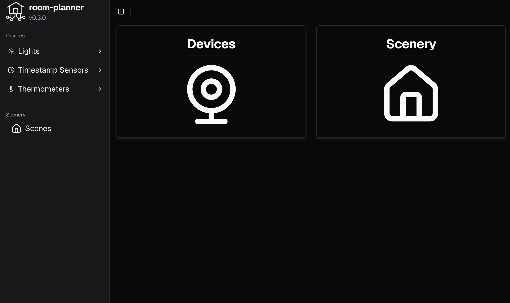
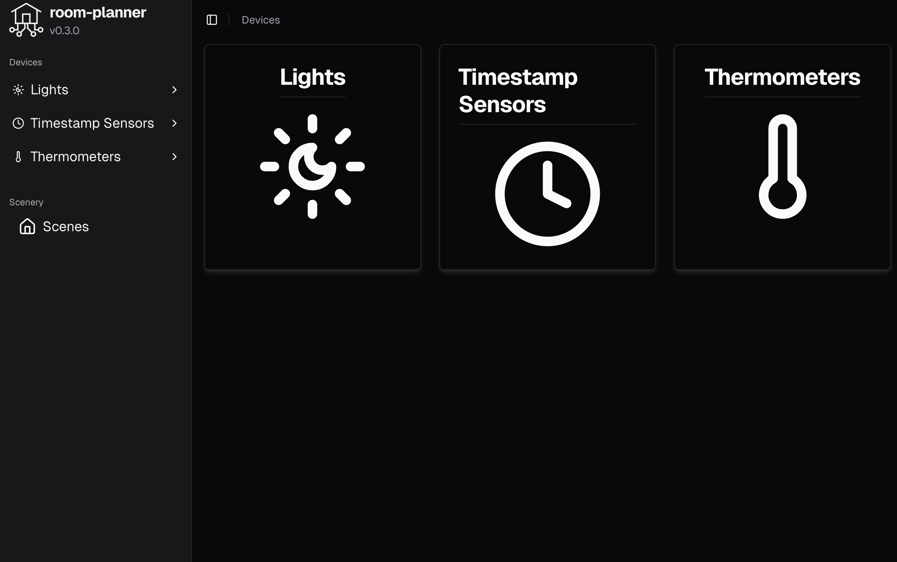
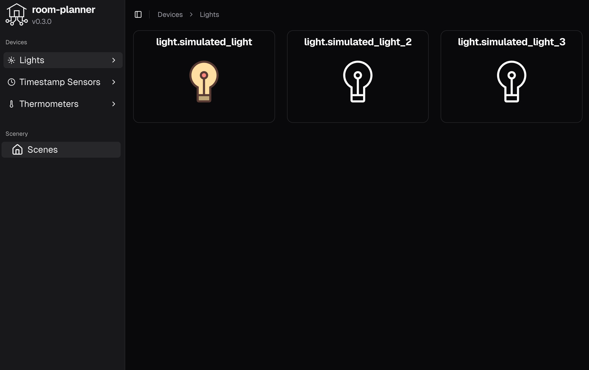
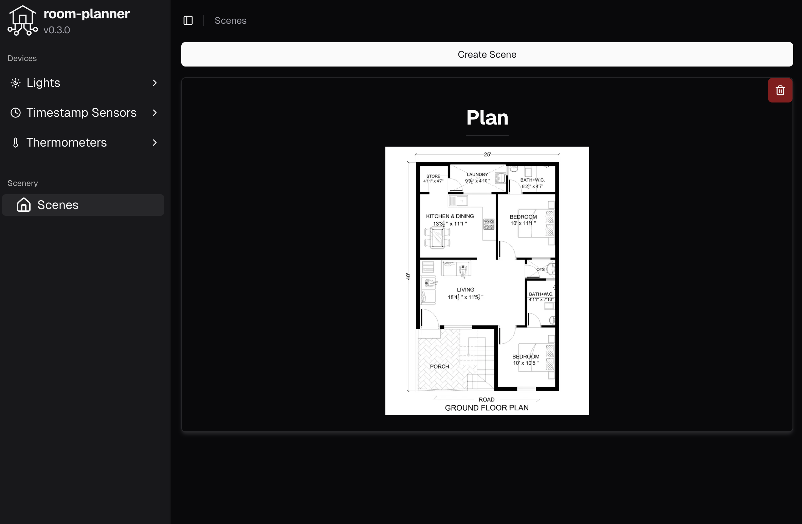
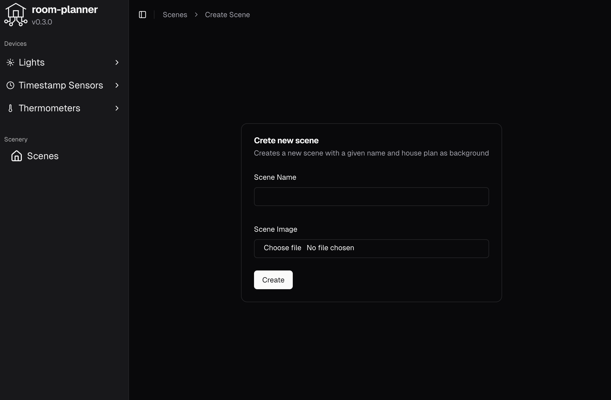
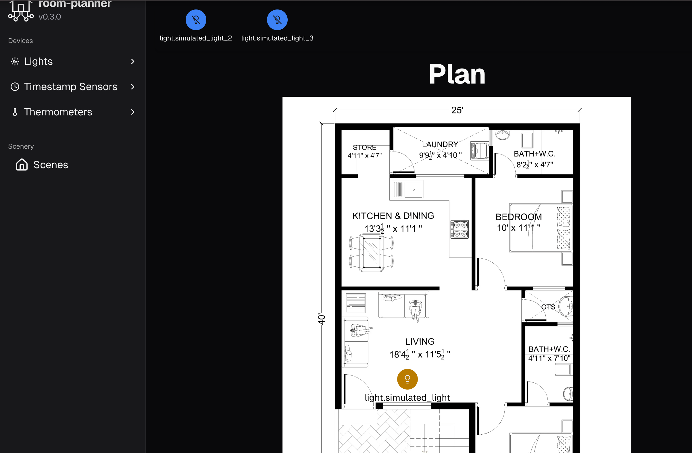

The application is hosted at [room-planer app](https://room-planner.critteros.dev/)!

From main page you are able to access all your devices,
for example lights

By pressing on desired element you are able to toggle it's function (turn on/turn off light).
All elements are integrated with Home Assistant platform,
so their state is taken from HA and all changes applied to them are also visible in HA interface.

From main page you can also access page with all scenes:

To define a new scene upload your own image and give the scene a name:

After scene creation, access the scence and place elements in desired room.
You can also toogle function of each element from scene view by pressing on it's icon.

